# Managed Agent Platform

An internal team ships an AI agent by registering a definition and calling a small REST
API. They never see an agent loop. **This is the layer that makes handing them one safe.**

---

## Contents

**The brief** — what this is and why it is built this way:

1. [What the platform is](#01--what-the-platform-is) — the layer, and the one noun a team gets
2. [Why it exists](#02--why-it-exists) — six problems, solved once instead of five times
3. [The design philosophy](#03--the-design-philosophy) — what we took from two prior platforms, and where we depart
4. [How it works](#04--how-it-works) — the map, one tool call, and what a crash costs
5. [Inside the system](#05--inside-the-system) — how the code is arranged, and where each rule is actually kept
6. [The choices, and what they cost](#06--the-choices-and-what-they-cost) — eight decisions a reader would otherwise want to argue with

**The manual** — how to run it, call it, and make it yours:

- [Quick start](#quick-start)
- [The REST API](#the-rest-api) — headers, refusals, and all 67 operations
- [Deploying it](#deploying-it) — prerequisites, one command, rollback
- [Customizing it for your company](#customizing-it-for-your-company) — every seam, and the one that deliberately isn't there
- [Development](#development) — the gates, the test tiers, and what a green run does not mean
- [Repository layout](#repository-layout)
- [What is not done](#what-is-not-done)

---

## 01 · What the platform is

*The layer, and the one noun a team gets.*

Four layers sit between a person and a model. We build exactly one of them.

At the top is the team's own product. At the bottom are the models. In between sits the
**agent loop** — the thing that reads a task, calls a tool, reads the result, and decides
again until it is done.

That loop used to be everyone's problem. It is not any more: good ones are now open
source. So we take one as-is and never patch it. What is left over is the layer nobody
hands you — who is allowed to reach what, what actually happened, what it cost, and how a
person takes the work back.



The governing rule that comes with that position: **solve the general agent problem once,
keep the enterprise-specific problems in this layer, and leave domain knowledge to the
people who have it.**

### A team gets one noun

The surface is deliberately small. A team creates a **Session**, sends it work, and reads
what came back. Every other idea here is a property of that one thing.

| the noun | what it means here |
|---|---|
| **Session** | One job, one pod, one record. Create it, suspend it, resume it, stop it. The only thing a team addresses. |
| **Agent definition** | What the agent *is*, written down instead of coded: instructions, a pinned skills revision, a model, a tool list. Versioned, never edited in place. |
| **Grant & Scope** | Which tools this Session may reach, and which slice of data those tools may touch. "This customer", not "the customer table". |
| **Turn** | One round of the agent working. Also the unit of safety: a Session resumes at its last finished Turn. |
| **Evidence** | Any tool result big enough to matter, written to a file and hashed *before* the model reads it — so an answer can be traced to its source. |
| **Event log** | Everything that happened, append-only and strictly ordered. There is no status column anywhere; state is computed by reading this forward. |

---

## 02 · Why it exists

*Six problems, solved once instead of five times.*

A demo agent needs a model, a prompt, some tools and a loop. A production one needs six
more things, and none of them are about the model:

1. **Where does the agent run?**
2. **Where does its history live?**
3. **How does it get a filesystem?**
4. **Where does its code execute safely?**
5. **How does it reach secrets without seeing them?**
6. **How does anyone tell what it actually did?**

Teams were spending most of their time on those six instead of on their product. That is
the gap this fills.

### The two ways it goes wrong without this layer

| **One agent per use case** | **Just give everyone a coding agent** |
|---|---|
| Sales prep, finance analysis, incident triage — each copies a prompt and wires its own tools. Fast at first, then the shared basics diverge: different retries, different permissions, different audit, different output rules. | Coding agents have powerful file, terminal and execution abilities — aimed at an engineering workspace. Knowledge workers need business objects, controlled data and a shareable report, not an arbitrary shell. |
| Nobody can tell whether a bug is the prompt, the tool, or the model. | Handing that power over unchanged hands the security risk to the user too. |



**What changes is where the lines go.** On the left, five concerns are rebuilt per team
and every path out carries its own key. On the right the paths converge — which is what
makes a single record, and a single place to revoke, possible at all.

### Why now, specifically

Two things landed at once. A capable agent loop was open-sourced with exactly the hooks
this needs — per-thread configuration, an admin layer that can block a tool call, remote
tool servers with per-server allowlists. And we needed a model gateway regardless, because
the Claude models we reach sit behind Azure Foundry and speak a different wire than the
loop expects.

So the expensive half was free, and the other half we were paying for anyway.

---

## 03 · The design philosophy

*What we took from two prior platforms, and where we depart.*

Two teams built this layer before us and wrote down what they learned. We took their
principles on purpose, and departed from one of them on purpose.

### A user's full permissions must not automatically become one task's full permissions

This is the idea the whole enforcement design hangs on. A traditional app authorizes a
*person*. An agent adds a delegation step: the person authorizes the agent to do *one
task*. What that task may reach should be far narrower than what the person may reach —
and it is not one permission but the **intersection of five separate narrowings**.



**Capability is an intersection, not a permission.** Two rings are real, one is the
tenant's own, and two are narrower on paper than in the running system. Measured from the
source rather than from a design document:

**Scope is enforced.** Every tool declares, at registration, which of its arguments the
Session's Scope constrains — a tool with no expressible Scope Binding cannot be registered
at all. At call time the Tool Gateway writes the Scope's value into that argument over
whatever the model supplied, and refuses the whole call when the Scope carries no value
for a bound dimension. The clamp runs *before* the upstream connection is opened, so a
call that will not be made never reads a credential on its way to being refused. Refusing
on disagreement rather than overwriting was considered and rejected: it would hand the
model an oracle — call with a guess, read whether you were refused, binary-search the
Scope value.

**The Grant shapes the tool list; it is not yet checked at the call site.** The catalogue
the model is offered is rendered from the Session's Grant, so a tool the Session was not
granted is not advertised. But the Gateway resolves a called name against *the tenant on
the token*, not against that Session's Grant. So today the guarantee is tenant-level, and
it should not be described to a customer as anything more. The structure is in place and
the missing piece is a comparison at one call site — named in
[What is not done](#what-is-not-done).

> **The pitfall we are currently standing in.** Treating the tool list as the
> authorization is a mistake. A tool list describes what the model should *see*; real
> authorization has to be checked by the gateway and by the target service. Our Tool
> Gateway resolves a tool against the tenant on the token and consults no per-Session
> Grant on that path — the code says so in its own comment.

### Where we depart: the brain and the hands

The biggest architectural decision in Anthropic's managed-agents work was to **split the
agent loop from the place tools run**. They started with both in one container and moved
away from it. We deliberately went the other way, and this is the one place our design
disagrees with a source we otherwise follow.



| | decoupled (theirs) | co-located (ours) |
|---|---|---|
| **shape** | loop is hosted; sandbox starts on demand, possibly in the customer's VPC | one Session is one pod holding both |
| **buys** | reasoning starts before the container is ready; 60% faster to first token at the median; a dead sandbox is retried, not fatal; the hands can run in the customer's network | a kernel-level sandbox with deny rules; the loop enforces in-process; **one edge to prove keys never cross**; no second component to keep in step |
| **costs** | two moving parts to keep alive and in step; the sandbox boundary is a service contract rather than a process boundary | pod-hours scale with live Sessions, idle or not; container setup sits on the critical path; losing the pod costs a turn — bounded, not free |

Splitting the two buys latency and reliability. Keeping them together buys a boundary you
can point at: the pod edge. We took the boundary and pay for it in pod-hours, and
`suspend` exists specifically to bound that bill.

### The rest of what we took

**The log is a durable resource, not a debug view.** *(from Anthropic)* In most harnesses
the context window and the session are the same thing, so anything the model discards is
gone. Writing every event to a durable log instead means context can be read back into the
window later. One artifact, two payoffs: observability for the human, recoverable context
for the agent.

**Keep credentials away from the agent.** *(from Anthropic)* Their answer was vaults,
decrypted only at tool-execution time, so the model never sees a token. Ours is the same
instinct drawn as topology: the credential holders sit outside the pod, and **the pod is
given no cloud identity at all**.

**A prompt is not a security boundary.** *(from Tencent)* "Don't touch other customers'
data" helps a model choose well. It cannot be the control. The boundary has to be in the
tool layer or the sandbox, where the model's wording cannot reach it.

**Split state into three kinds.** *(from Tencent)* Facts fixed at creation the model may
never edit; working state that can be checkpointed; large artifacts held as paths with the
bytes in a file store. Keep them apart and a summarization can never quietly change a
permission.

**The sandbox protects the host, not the data.** *(from Tencent)* An isolated container
stops the agent damaging the machine. It says nothing about the input files, the network,
the credentials, the runtime, or how much output leaves. Each of those needs its own limit.

**Adopt the loop. Never fork it.** *(ours)* Every personality, tool, sandbox and approval
decision is a config key. If a change would need patching the runtime's source, we picked
the wrong extension point and go back. A fork puts the maintenance cost we are adopting to
shed straight back on us.

---

## 04 · How it works

*The map, one tool call, and what a crash costs.*

One live Session is one pod. Everything valuable sits outside that pod, and **the pod is
treated as untrusted**.

The pod runs the agent loop in a sandbox. It holds **no keys and no cloud identity** — it
cannot even write to the object store; the control plane reads the resume state out over
the channel it already opened. The two gateways on the far side hold the credentials.



**The credential boundary is the whole topology.** Because the pod holds no key and no
cloud identity, an agent that goes wrong cannot use one. It can only ask a gateway — and
the gateway looks up what it is allowed to do rather than believing anything the pod says
about itself.

### One tool call, start to finish

The tool path is where most of the enforcement lives, so it is worth following a single
call all the way through. Two details in it are deliberate and neither is obvious.

First, **an unknown tool and a forbidden tool get the identical refusal.** Two distinct
errors would be friendlier to debug against — and would let a model map a tenant's entire
tool inventory just by calling names and reading which refusal came back.

Second, **large output is captured and hashed before it is handed back**, at the last point
an enterprise result passes that the pod cannot reach, inside the tool's own deadline. So a
call that cannot be recorded fails rather than succeeding unrecorded.



### What a crash costs

Pods die. Nodes die. Rather than trying to prevent that, the cost is a sentence you can
test: **a Session resumes at its last finished Turn.** Not "usually", and not "depending on
how it died".

The trick is in the cut. A resume record that ended mid-turn would replay a half-written
tail, so the incomplete part is cut off *before the bytes ever reach a new pod* — which
makes the boundary a property of the platform rather than a hope about how the old pod
happened to fail.



**Losing a pod is normal operation, not an incident.** The cost of that guarantee: a full
write of the resume state at every single turn, growing with how long the conversation has
run. It is the one thing here that gets more expensive with a Session's *age* rather than
its activity.

### The log is the state

There is no status field anywhere — the code that defines the four Session states says
outright that they are **never persisted**. Current state is computed by reading the log
forward. Work that got thrown away is **marked, never deleted**, because a reader who has
already seen event 40 must never find that event 40 changed underneath them.



**State is derived, never stored twice.** Two copies of a fact can disagree, and when they
do nothing can say which is lying. What it costs: the log carries work that was thrown
away, and every reader must understand a marker.

---

## 05 · Inside the system

*How the code is arranged, and where each rule is actually kept.*

A rule is only real where it is enforced. Most of the design work here was deciding
*where* to put each one, so that forgetting it becomes impossible rather than merely
discouraged. Three places carry that weight: **the type system, the database, and the
linter.** Very little is left to a reviewer's memory.

### How the code is laid out

Ports and adapters, with a single composition root. `core` holds the vocabulary and the
ports — **17 Protocols and no drivers**: no database client, no HTTP client, no cloud SDK.
The control plane, the two gateways and the pod shim all depend on those ports. `adapters`
implements them against Postgres, S3, Kubernetes and the secret store.



**Dependency arrows all point inward, and one file is exempt.** The adapters point up into
`core` because `core` defines the interface and the adapter implements it — the low-level
module depends on the high-level one, not the reverse. Exactly one file, `composition.py`,
is allowed to know that the relational port is Postgres and the object port is S3. That is
what makes a cloud move a swap rather than a rewrite.

And that rule is not a convention. Ruff's banned-import list refuses
`managed_agent.adapters`, `sqlalchemy` and `aioboto3` everywhere in the package except
`adapters/` itself and the composition root. **A layering rule a reviewer has to remember
is a layering rule that erodes.** The exemption is what makes the rule checkable: it is one
line in the lint config, not a paragraph in a wiki.

### What the database enforces, rather than the code

Seven components append to one Session's log. **A rule that lives in one of them is not a
rule** — so every guarantee the log makes is made by the table itself.

| constraint | what it makes impossible |
|---|---|
| `PRIMARY KEY (session_id, seq)` | A duplicate sequence number is a constraint violation, not a second row. Two writers racing on the same Session **fail loudly** instead of quietly interleaving. |
| `CHECK (seq >= 1)` | The sequence can never start at zero, so "event 0" is not a state the rest of the system has to hold an opinion about. |
| `TRIGGER … BEFORE UPDATE` | An `UPDATE` **raises**. It does not silently do nothing — a rule that absorbed the write would leave the earlier events correct while reporting success to a writer whose change never landed. |
| `DELETE` — left open on purpose | Expiry is a real operation this platform performs. **A table that cannot forget cannot honour a retention policy.** So the one destructive verb stays available, and everything else is closed. |
| a second table: the high-water mark | Because `DELETE` is open, `max(seq)` is not a safe source for the next number. Once a sweep removes a Session's whole log it returns null and numbering restarts at 1 — **reissuing identities that were already handed out.** Not a gap, which the primary key catches loudly; a duplicate identity across time, which nothing catches at all. |
| and absence carries meaning | A Session with no appends has **no row** in that table rather than a row holding 1. Absence is the only thing that separates "never written" from "written and then swept", and a default row would erase the distinction. |

### Two rules kept in the type system

Where a rule can be made *unrepresentable* rather than merely checked, it is.

**Overwriting evidence is not refused. It is not expressible.** A Session's durable
filesystem is split into lanes, and lanes come in two *kinds*: sealed and rewritable. The
replace operation accepts a mutable-file handle and nothing else — and such a handle
cannot be constructed over a sealed lane, because its lane field is typed to the kind that
permits rewriting. A boolean on the lane, or a string compared at each call site, would put
the guarantee in every caller's hands. The one caller that forgets is the one that matters:
an agent that can overwrite its own evidence can correct the record it is meant to be judged
against, and every recorded hash becomes a claim about bytes that may no longer exist.

**A new model wire is a new file, not a new branch.** Every construct that can cross a
translated wire is classified ahead of time by one question: would dropping or flattening
it let the agent believe a Turn ended normally when it did not? The mechanism lives in one
module and the per-wire knowledge does not — each wire owns its own table and installs it
when it is imported. So adding a wire means writing a file, never adding a branch to a
shared switch. And a wire whose table was never installed *raises*, rather than classifying
everything as unknown: that is a wiring fault in our own process, and reporting it as a
stream of upstream surprises would send somebody looking in the wrong place.

### The model gateway

The loop speaks one wire. The models we can reach speak three. The gateway is the
translator, and the interesting design is in what it refuses to do.

**A model name is a routing key, not a promise about what a model can do.** The lookup
fails rather than falls back: there is no default entry, nothing infers a shape from a base
URL, and no second shape is tried after one fails. A guess that happened to work would
afterwards be indistinguishable from a correct answer.



**The permissive outcome is the one that writes a falsehood into an append-only log.** So
it has to be chosen deliberately rather than arrived at by omission. A construct nobody
classified is treated as though it had failed, and the failure names what it choked on. The
gateway lags providers on purpose: a new upstream feature is a code change first, because
"the Turn completed" must never mean a Turn that was silently truncated.

### The pod's floors

The configuration a pod starts with is a value we render, mount, and then **deny to every
command the agent runs**. Three of its floors are load-bearing and none of them announces
itself: a TCP listener added for convenience, a second tool server placed beside the
gateway, or a missing deny rule — each one reopens the runtime's whole un-gated control
surface.

**Deny rules are absolute path prefixes and never globs.** A glob makes the runtime scan
the file tree while it compiles the sandbox arguments, and an expansion past its match cap
is fatal: the confined command then does not run at all, so *the same rule set passes on one
node and bricks another*. Over a network-backed mount that scan is also a directory walk
across the wire. A prefix costs neither.

Half the floors are absences and half are presences, and the presences are not padding — an
empty document satisfies every absence. So each absence is checked beside the presence that
makes it mean something, and a compiler that emitted nothing fails the check rather than
passing it. The check runs on the way *out* of compilation rather than only from a test, so
a configuration missing a floor is never returned at all; and it parses the rendered
document back before asserting, because what matters is **the document the runtime loads,
not the text we concatenated**.

### The rule underneath most of the above

> **Two copies of a fact can disagree. One cannot.**

That single idea drives more of this design than any other: state derived from the log
instead of stored twice, one place credentials live, one place adapters are wired, one
refusal for two questions, one writer per file, one account id derived from the credentials
rather than written into ninety files. Each time, the alternative was more redundancy — and
more places for the system to lie to itself.

---

## 06 · The choices, and what they cost

*Eight decisions a reader would otherwise want to argue with.*

None of these was free. Each row names the option we turned down and the bill we chose to
pay, because a design brief that only lists wins is a sales document.

| chosen | instead of | cost paid |
|---|---|---|
| **The brain and the hands share one pod.** One Session is one pod holding the agent loop and its sandbox together, with the pod edge as the credential boundary. | Anthropic's split, where the loop is hosted and the sandbox starts on demand and can run anywhere. | Pod-hours scale with live Sessions whether or not they are doing anything, and container setup sits on the critical path. We took the provable boundary over the faster start; `suspend` exists to bound the bill. |
| **A seam where a second thing is coming. None where it isn't.** Storage and the model provider each get a real swap point, wired in exactly one file. The agent loop gets none. | Abstracting everything "for flexibility", or abstracting nothing and pasting concrete types everywhere. | Lock-in to one runtime, accepted openly. Replacing it later means real surgery. But it has one implementation, and a seam would be a guess about a second rather than a boundary drawn from two. |
| **The guarantees live in the schema and the linter, not in review.** Append-only is a database trigger. Layering is a lint rule. Both fail the build rather than the code review. | Documented conventions, enforced by whoever happens to read the pull request that week. | Rigidity. A legitimate exception now needs a migration or a lint exemption, both of them visible in the diff. That visibility is the point — but it slows the honest cases down too. |
| **The finished Turn is the save point.** Resume state is read out after every turn and cut clean, so recovery is one testable sentence. | Saving only on stop, saving continuously, or a disk that outlives the pod. | A full write every turn, growing with conversation length. This is the one cost that scales with a Session's *age* rather than its activity. |
| **Anything we cannot translate faithfully fails the turn.** Every construct on every model wire is classified ahead of time. Unclassified counts as failed. | Best-effort translation that never fails and quietly drops what it cannot carry. | The gateway lags model providers on purpose — a new upstream feature is a code change before anyone can use it. Worth it, because "the turn completed" must never mean a turn that was silently truncated. |
| **An unknown tool and a forbidden tool get the same refusal.** The gateway answers "not granted" both for a tool nobody registered and one this caller may not reach. | Two distinct errors, which is friendlier to debug against. | Harder to diagnose a typo. Two answers would let a model map a tenant's entire tool inventory just by calling names and reading which refusal came back. |
| **Large tool output is captured outside the pod, before the model reads it.** The capture happens at the last point an enterprise result passes that the pod cannot reach, inside the tool's deadline. | Capturing after the result is handed back, which is simpler and keeps every test green. | Two writes to two stores inside a deadline the agent loop is holding, so a call that cannot be recorded has to fail. In exchange, a large payload never enters the agent's context at all. |
| **Sealed lanes are a type, not a flag.** The rewrite operation accepts only a handle that cannot be built over a sealed lane, so overwriting evidence is unrepresentable rather than refused. | A boolean on the lane and a check at each call site — less machinery, and readable at a glance. | Two types where one would do, and a caller must decide a lane's kind when it declares it rather than when it writes. In exchange, the one caller who would have forgotten the check cannot compile. |

---

## Quick start

**Prerequisites:** [uv](https://docs.astral.sh/uv/), Python 3.12+, and a running Docker
daemon (the test fixtures start a real PostgreSQL 17 in a container — nothing here is
tested against a fake database).

```sh
git clone <this repository>
cd managed-agent-platform

make setup      # install the locked toolchain and every dependency
make check      # lint · format · types · merge residue · the offline suite
```

`make` with no target lists everything.

Neither a cluster nor AWS credentials are needed for any of that. The tiers that talk to
a real cluster are opt-in — see [Development](#development).

---

## The REST API

One base path, `/v1`. The surface is deliberately small: **a team creates a Session,
sends it work, and reads what came back.** Every other idea here is a property of that
one thing.

### Headers

| header | required | what it is |
|---|---|---|
| `X-Tenant-Id` | yes, on every tenant-facing route | which tenant this call acts as; every read and write is scoped to it |
| `anthropic-beta` | on routes behind a beta flag | opt-in to a surface that is not yet stable |

### Refusals

Every refusal, whatever produced it, has the same body:

```json
{
  "code": "tool.out_of_scope",
  "message": "the call to search_customers was not made: it is registered to be narrowed by the Scope dimension account, and this Session's Scope does not carry one",
  "detail": { "subject": "search_customers", "dimension": "account" }
}
```

`code` is one of 55 specific codes and answers *what exactly was wrong*. Alongside it the
HTTP status maps onto eight coarse classes — `invalid_request_error`,
`authentication_error`, `permission_error`, `not_found_error`, `request_too_large` and
three more — which answer *what kind of thing was wrong*, so a client generated from the
published document can classify a refusal without knowing this platform's vocabulary.

A refused call never carries a Scope value, a credential, or an upstream host in its
message.

### The full surface

Generated from the app's own OpenAPI document. `make api-surface` prints it, and
`tests/test_readme_lists_every_endpoint.py` fails if this table and the app disagree — so
an endpoint cannot be added without appearing here.

#### Sessions — the one noun a team addresses

| method | path | |
|---|---|---|
| `POST` | `/v1/sessions` | create a Session against an agent definition and an environment |
| `GET` | `/v1/sessions` | list this tenant's Sessions |
| `GET` | `/v1/sessions/{session_id}` | one Session, its state computed by folding its log |
| `POST` | `/v1/sessions/{session_id}` | update it — suspend, resume, hand over to a person |
| `POST` | `/v1/sessions/{session_id}/archive` | close it; refuses while a Turn is open, naming the Turn |
| `DELETE` | `/v1/sessions/{session_id}` | delete it |
| `POST` | `/v1/sessions/{session_id}/events` | **submit one Turn** |
| `GET` | `/v1/sessions/{session_id}/events` | every event of one Session, across as many reads as it takes |
| `GET` | `/v1/sessions/{session_id}/events/stream` | the same log as it happens |
| `GET` | `/v1/sessions/{session_id}/threads` | the threads within a Session |
| `GET` | `/v1/sessions/{session_id}/threads/{thread_id}` | one thread |
| `POST` | `/v1/sessions/{session_id}/threads/{thread_id}/archive` | close one thread |
| `GET` | `/v1/sessions/{session_id}/threads/{thread_id}/events` | one thread's events |
| `GET` | `/v1/sessions/{session_id}/threads/{thread_id}/stream` | one thread's events as they happen |
| `GET` | `/v1/sessions/{session_id}/resources` | everything this Session holds, in creation order |
| `POST` | `/v1/sessions/{session_id}/resources` | attach one more file to a running Session |
| `POST` | `/v1/sessions/{session_id}/resources/{resource_id}` | update one held resource |
| `GET` | `/v1/sessions/{session_id}/artifacts/{path}` | download a file the agent produced, at the path it wrote |

#### Agent definitions — what the agent *is*, written down instead of coded

| method | path | |
|---|---|---|
| `POST` | `/v1/agents` | register a definition: instructions, pinned skills, a model, a tool list |
| `GET` | `/v1/agents` | list definitions |
| `GET` | `/v1/agents/{agent_id}` | one definition |
| `POST` | `/v1/agents/{agent_id}` | update it |
| `POST` | `/v1/agents/{agent_id}/archive` | archive it |
| `POST` | `/v1/agents/{agent_id}/versions` | cut a new version — definitions are versioned, never edited in place |
| `GET` | `/v1/agents/{agent_id}/versions` | list versions |
| `POST` | `/v1/agents/{agent_id}/versions/{version}/archive` | archive one version |

#### Environments — where a Session runs

| method | path | |
|---|---|---|
| `POST` | `/v1/environments` | declare a runtime image, its limits and its egress posture |
| `GET` | `/v1/environments` | list environments |
| `GET` | `/v1/environments/{environment_id}` | one environment |
| `POST` | `/v1/environments/{environment_id}` | update it |
| `POST` | `/v1/environments/{environment_id}/archive` | archive it |
| `DELETE` | `/v1/environments/{environment_id}` | delete it |

#### Tool servers

| method | path | |
|---|---|---|
| `POST` | `/v1/mcp_servers` | register a server and every tool it offers, or refuse the whole registration — this is the only place a tool enters the platform, and a tool with no expressible Scope Binding is refused here |

#### Vaults and credentials — the values the pod never sees

| method | path | |
|---|---|---|
| `POST` | `/v1/vaults` | create a vault |
| `GET` | `/v1/vaults` | list vaults |
| `GET` | `/v1/vaults/{vault_id}` | one vault |
| `POST` | `/v1/vaults/{vault_id}/archive` | archive a vault |
| `DELETE` | `/v1/vaults/{vault_id}` | delete a vault |
| `POST` | `/v1/vaults/{vault_id}/credentials` | store a credential — at most 20 per vault, refused before the value is written |
| `GET` | `/v1/vaults/{vault_id}/credentials` | list credentials by name; no value is ever returned |
| `GET` | `/v1/vaults/{vault_id}/credentials/{credential_id}` | one credential's metadata |
| `POST` | `/v1/vaults/{vault_id}/credentials/{credential_id}` | replace the value |
| `POST` | `/v1/vaults/{vault_id}/credentials/{credential_id}/archive` | archive it |
| `DELETE` | `/v1/vaults/{vault_id}/credentials/{credential_id}` | revoke it — see the note on the revocation window below |

> **Revocation is not instantaneous.** A `204` means the value is gone from the vault, not
> that every in-flight call has stopped. The Tool Gateway holds a fetched credential for a
> bounded window (`ToolCredentialBroker.HOLD_S`, five minutes at the current setting), so a
> Session mid-call can still complete with the old value. If a key has leaked, rotate it at
> the provider as well.

#### Skills — delivered immutably at a pinned revision

| method | path | |
|---|---|---|
| `POST` | `/v1/skills` | register a skill |
| `POST` | `/v1/skills/repository` | register a repository of skills |
| `GET` | `/v1/skills` | list skills |
| `GET` | `/v1/skills/{skill_id}` | one skill |
| `DELETE` | `/v1/skills/{skill_id}` | delete a skill |
| `POST` | `/v1/skills/{skill_id}/versions` | cut a revision |
| `GET` | `/v1/skills/{skill_id}/versions` | list revisions |
| `GET` | `/v1/skills/{skill_id}/versions/{version}` | one revision |
| `GET` | `/v1/skills/{skill_id}/versions/{version}/content` | the revision's bytes |
| `DELETE` | `/v1/skills/{skill_id}/versions/{version}` | delete a revision |
| `POST` | `/v1/skills/evals` | grade one revision against its repository's baseline and record the verdict |
| `GET` | `/v1/skills/baselines` | the bar every skill in a repository currently has to clear |

#### Files

| method | path | |
|---|---|---|
| `POST` | `/v1/files` | upload bytes a Session can be given |
| `GET` | `/v1/files` | list files |
| `GET` | `/v1/files/{file_id}` | one file's metadata |
| `GET` | `/v1/files/{file_id}/content` | its bytes |
| `DELETE` | `/v1/files/{file_id}` | delete it |

#### Webhooks

| method | path | |
|---|---|---|
| `POST` | `/v1/webhooks` | register a callback |
| `GET` | `/v1/webhooks` | list callbacks |
| `DELETE` | `/v1/webhooks/{webhook_id}` | remove one |

#### Operations

| method | path | |
|---|---|---|
| `GET` | `/v1/healthz` | liveness — answers about the process, not about what it can reach |
| `GET` | `/v1/capacity` | how many Turns are waiting for a pod, how many Sessions they belong to, and how long the longest has waited |
| `GET` | `/v1/audit/sessions/{session_id}/events` | any Session's log, for a platform reviewer who holds no tenant credential |

### The shape of a first integration

```
1.  POST /v1/vaults                          → a vault
2.  POST /v1/vaults/{id}/credentials         → the key your tool server needs
                                               (the pod will never see this value)
3.  POST /v1/mcp_servers                     → your tool server + its Scope Bindings
4.  POST /v1/environments                    → the runtime image and its limits
5.  POST /v1/agents                          → instructions, model, tool list, skills
6.  POST /v1/sessions                        → Grant + Scope for this one task
7.  POST /v1/sessions/{id}/events            → submit a Turn
8.  GET  /v1/sessions/{id}/events/stream     → watch it work
9.  GET  /v1/sessions/{id}/artifacts/{path}  → take the output back
```

Steps 1–5 happen once per integration. Steps 6–9 are the loop your product runs.

---

## Deploying it

The deploy is `make deploy`. Everything below is what that command does and what has to
be true first.

### What has to exist first

| | how it gets there |
|---|---|
| A Kubernetes cluster, a PostgreSQL instance, S3 buckets, an ECR registry, and the IAM roles the three workloads assume | `deploy/terraform/` — `make infra-plan`, then `make infra-apply CONFIRM=yes` |
| A Kubernetes Secret `map-control-plane` with keys `database-url` and `shim-token-key` | created by a person; **the values are not in this repository and must not be** |
| A Kubernetes Secret `map-tool-gateway` with key `session-token-key` | same |
| Vault entries for every model provider named in the routing table | AWS Secrets Manager, by name |

`make infra-apply` refuses without `CONFIRM=yes`, because Terraform here owns the
cluster, the nodegroup, RDS, the VPC and the buckets — an apply that replaces one of
those destroys running state. Read `make infra-plan` first, every time.

**`deploy/terraform/` adopts an environment; it does not create one from nothing.** Most
resources in it carry an `import` block, because this configuration was written over
infrastructure that already existed, and the names it uses (`map-dev`, `map-dev-eks-node`)
are that environment's. Standing up a second environment means changing those names and
dropping the `import` blocks for anything you are creating rather than adopting — a plan
against an empty account fails on the first `import` with `Cannot import non-existent
remote object`, which is loud and is the intended failure. Two values are already derived
rather than written down, so nothing here names an account you do not own: the account id
comes from `aws sts get-caller-identity` via `data.aws_caller_identity` (`account.tf`),
and the state bucket is supplied by `terraform init -backend-config=backend.hcl` — copy
`backend.hcl.example` and fill in your own. The cluster's OIDC issuer id in `iam.tf` is
still a literal, deliberately: an import id that referenced the cluster resource would not
be known at plan time, which is a rule `tests/deploy/` enforces on every import block.

### The deploy

```sh
make preflight   # credentials resolve, kubectl points at the right cluster, Docker is up
make deploy      # image → cluster objects → control plane → tool gateway → model gateway
```

`AWS_PROFILE` defaults to `map-dev-agent`; override it for another account:

```sh
make deploy AWS_PROFILE=map-prod
```

The order in `make deploy` is not arbitrary and is not modelled anywhere else. The image
must be in the registry before a manifest can name its digest. `bootstrap` creates the
namespace and the identities the workloads run as. The control plane carries the schema
migration Job and the Tool Gateway reads tables that Job creates, so the Tool Gateway
goes second. The Model Gateway depends on neither and goes last.

Individual workloads roll on their own when only one changed:

```sh
make deploy-control-plane
make deploy-tool-gateway
make deploy-model-gateway
```

### What the applier refuses, and why it exists at all

`deploy/platform.py` does nine things `kubectl apply -f` cannot, and each one is a way
this job goes wrong **silently** rather than a convenience:

- **A manifest can lose a variable and stay valid.** A workload with an incomplete
  environment starts, passes its probes, and does less than it is for. A control plane
  once ran accepting Sessions and placing a pod for none of them, because two variables
  were absent and the process cannot tell "not configured to place" from "not a placer".
- **A Deployment can mount a ConfigMap nobody created**, which leaves the pod at
  `ContainerCreating` — a state a pod *sits in* rather than a crash.
- **The manifests carry a placeholder image.** Sixty-four zeros is digest-shaped, so it
  parses everywhere and resolves nowhere. The applier substitutes the digest the registry
  holds for *this commit's* tag, and refuses if nothing has pushed this commit.
- **An absent `secretKeyRef` is `CreateContainerConfigError`** — again, a state, not a
  crash. Checked before anything is applied.
- **A database credential can be right and stop working.** The RDS master password
  rotates; a DSN built from it works and then fails days after the deploy. Refused unless
  `--allow-rotating-credential` says it was chosen.
- **Finishing is not working.** `kubectl rollout status` exits 0 for a Deployment scaled
  to zero.
- **A Service can apply cleanly and route to nothing.** A selector matching no pod is
  valid YAML. This has happened here: a Session pod at `2/2 Running` with a healthy shim
  failed every Turn as unreachable, with every probe in the chain reporting fine.
- **A workload can name a vault entry the account does not hold.** Nothing fetches one
  until a request needs it, so the pod starts, the probes pass, and every request that
  needs it fails hours later at AWS.
- **A NetworkPolicy can be accepted, listed, and enforced by nothing.** That is worse
  than having no policy: a security control that exists as text, with nothing about the
  cluster saying which it is.

### Rolling back

Every manifest names an image by digest, and the ECR repositories are immutable — a tag
names one byte set for good. To roll back, check out the previous commit and roll:

```sh
git checkout <previous-sha>
make deploy-control-plane
```

The applier resolves that commit's tag to its digest and rolls the Deployment to it. No
separate rollback artifact exists because none is needed: the image for every commit that
was ever deployed is still in the registry under its own tag.

### There is no deploy job in CI, on purpose

Deploying means holding AWS credentials that can place pods, read the vault and roll
three Deployments. Putting them in a CI secret would widen who holds them from "an
operator at a terminal" to "anything that can trigger a workflow". `make deploy` is the
deploy, and a person runs it.

---

## Customizing it for your company

Every seam below is a real one — wired in exactly one file, with at least one working
implementation on each side. The absence of a seam is also a decision, and the one place
there deliberately isn't one is named at the end.

### Swap the infrastructure

`core/` holds the vocabulary and the ports: seventeen Protocols and no drivers — no
database client, no HTTP client, no cloud SDK. `adapters/` implements them against
PostgreSQL, S3, Kubernetes and AWS Secrets Manager. **Exactly one file,
`composition.py`, is allowed to know which is which.**

To move a cloud, write an adapter and change one wiring line:

| port | today | what a swap costs |
|---|---|---|
| `EventLogAppend` / `EventLogRange` | PostgreSQL | the append-only guarantees are schema constraints, so a new store has to provide them or the property is lost |
| `ObjectStore`, `LaneBlobs`, `EvidenceBlobs` | S3 | any content-addressed blob store |
| `CredentialVault` / `CredentialVaultWriter` | AWS Secrets Manager | any vault that can hold a named value |
| pod placement | Kubernetes | the pod contract is a manifest plus a seccomp profile |

Ruff enforces the boundary: importing `managed_agent.adapters`, `sqlalchemy` or
`aioboto3` from anywhere except `adapters/` and `composition.py` fails lint. You cannot
quietly reach around this.

### Point it at your models

Model routing is a ConfigMap in `deploy/k8s/model-gateway.yaml`. One entry per model
name:

```json
{
  "entries": [
    {
      "model": "your-deployment-name",
      "wire": "anthropic_messages",
      "base_url": "https://<your-endpoint>/anthropic",
      "auth_scheme": "api_key",
      "credential_name": "your/vault/entry/name",
      "query_params": {}
    }
  ]
}
```

Nothing in that document is a secret — `credential_name` is a vault entry's *name*, not
its contents, which is what makes the table safe to keep in configuration a cluster
reader can read.

Three wires ship: `responses` (passed through untranslated), `anthropic_messages` and
`chat_completions` (translated both ways). **A model name is a routing key, not a promise
about what a model can do.** The lookup fails rather than falls back: there is no default
entry, nothing infers a shape from a base URL, and no second shape is tried after one
fails. A guess that happened to work would afterwards be indistinguishable from a correct
answer.

Adding a fourth wire is a new file under `gateway/model/`, not a branch in a shared
switch. Every construct that can cross a translated wire is classified ahead of time by
one question: *would dropping or flattening it let the agent believe a Turn ended
normally when it did not?* Unclassified counts as failed — silence is not permission.

### Register your own tools

`POST /v1/mcp_servers` takes an MCP server over stdio or Streamable HTTP, plus its Scope
Bindings. A tool whose arguments cannot express the Scope narrowing **is refused at
registration**, which is the whole point: the enforcement is decided when the tool is
declared, not argued about at call time.

The credential your server needs goes in a vault and is referenced by name. The Gateway
fetches it per call within a TTL and injects it; the pod never holds it and cannot ask
for it.

### Bound what the agent may touch

- **Filesystem and network:** Permission Profiles are absolute path prefixes and
  **never globs**. A glob makes the runtime scan the file tree while compiling the
  sandbox arguments, and an expansion past its match cap is fatal — the confined command
  then does not run at all, so the same rule set passes on one node and bricks another.
  Over a network-backed mount that scan is also a directory walk across the wire.
- **The sandbox itself:** `deploy/seccomp/session-sandbox.json`, installed onto every
  node by a DaemonSet.
- **Egress:** declared per Environment. `deploy/k8s/network-policies.yaml` holds the
  policies — read the note in `deploy/platform.py` about the CNI flag before relying on
  them.
- **Spend:** the gate runs between Turns, not inside one.

### Change the look of a Session's filesystem

A Session's durable filesystem is a composite of lanes. Sealed lanes (evidence) and
rewritable lanes (working files) are **different types**, not the same type with a
boolean, so a rewrite over a sealed lane does not compile. Adding a lane means declaring
its kind at the point it is declared, which is the cost that buys the guarantee.

### The seam that is deliberately absent

**The agent loop has no swap point.** It has exactly one implementation, so a seam would
be a guess about a second rather than a boundary drawn from two — and every abstraction
built over one implementation encodes that implementation's assumptions while claiming
not to. The lock-in is accepted openly: replacing the runtime later means real surgery.

What protects the position instead is the no-fork rule. Every personality, tool, sandbox
and approval decision is a config key. **If a change would need patching the runtime's
source, the wrong extension point was chosen — go back.**

---

## Development

### The gates

```sh
make check
```

is `lint`, `format-check`, `types`, `residue` and `test`, in the order CI runs them. Each
is also a target on its own. **No gate can be skipped**: if lint fails, fix the lint —
don't disable the rule; if a test fails, fix the code — don't skip the test.

| gate | command | what it catches |
|---|---|---|
| lint | `make lint` | style, unused code, and the layering ban — a `core/` module importing an adapter fails here |
| format | `make format-check` | `make format` rewrites |
| types | `make types` | `mypy --strict` over `src`, `tests` and `migrations` — the paths come from `pyproject.toml`, so this and a bare `mypy --strict` grade the same tree |
| residue | `make residue` | conflict markers a merge resolution left behind in YAML, Markdown, JSON or Terraform, where they are just text and lint cannot see them |
| suite | `make test` | the offline suite, against a real PostgreSQL in a container |

CI runs exactly these targets. The workflow defines no command of its own, so what CI
runs and what you type cannot drift apart.

### Test tiers, and what a green run does not mean

The default run is offline and deterministic. Two marks are deselected by default —
`network` (reaches a service on the public internet) and `image` (builds a container) —
and every tier that touches real infrastructure is behind an environment variable.

**A green summary does not mean the tiers below ran.** `pytest -rs` prints every skip
reason, and the reasons in this suite are written to say plainly what was *not* checked.
CI passes `-rs` for that reason. `make gates` lists every gate; `tools/skip_gates.py`
scans for them, so a new one cannot hide.

| gate | what it turns on | costs | creates real infrastructure? |
|---|---|---|---|
| `MAP_CLUSTER_TESTS` | every tier that talks to the live cluster — pod runs, node preconditions, the seccomp profile, the Tool Gateway, the IAM role readback | AWS credentials, minutes | pods and namespaces, which each tier deletes |
| `MAP_ECR_TESTS` | reads of the real registry: which images and tags exist, and their digests | AWS credentials, seconds | no |
| `MAP_IAM_READBACK` | reads each declared IAM role back out of the account. **The only check that can adjudicate a service principal** — `CreateRole` decides by refusing, so a wrong spelling is observable only as a role's *absence* | AWS credentials, seconds | no |
| `MAP_PROVISION_SESSION_VFS` | mounts a real Session VFS into a real pod | AWS credentials, minutes, **money** | **yes** — which is why it is separately gated and must stay that way |
| `MAP_TERRAFORM_DRIFT` | compares the account against the configuration | AWS credentials, ~a minute | no |
| `MAP_TERRAFORM_RENDER` | renders a real `terraform plan` and grades it | AWS credentials, ~a minute | no |

Before adding a gate, grep the name across the whole repository. **If it appears only at
its own definition, it is not a gate — it is an off switch with nobody holding it.** This
project has paid for that once: a gate named nowhere else meant six verification rounds
ran green without ever reaching the one check that could have answered the question they
were asking.

### Testing conventions

- Tier 1 runs against a **real PostgreSQL**, not a fake, because every property claimed —
  a primary key that refuses a duplicate, a check constraint that refuses sequence 0, an
  advisory lock that serializes two writers — is a property of PostgreSQL and not of any
  code we could stand in for it.
- Tests assert **outcomes**, not mock calls.
- A guard is only worth having if it has been **falsified**: change the code it protects
  and watch it fail. A guard nobody has seen fail is a guard nobody knows works.

---

## Repository layout

```
src/managed_agent/
  core/          vocabulary, ids and ports — Protocols only, no drivers
  control/       the tenant REST surface, session placement, files, skills, webhooks
  gateway/model/ the model wires and their classification tables
  gateway/tool/  the MCP surface, the Scope clamp, evidence capture, the credential broker
  session_shim/  the pod-local translator between platform vocabulary and the runtime wire
  adapters/      postgres · s3 · kubernetes · secrets
  composition.py the only place a port meets an implementation

migrations/      the DDL; the append-only guarantees live here, not in the code
deploy/
  terraform/     the account: cluster, nodegroup, RDS, VPC, buckets, IAM
  k8s/           the manifests, including the model routing table
  docker/        image builds and pushes
  seccomp/       the sandbox profile
  bootstrap.py   the cluster objects a Session pod needs
  platform.py    the applier — nine refusals kubectl apply cannot make
tools/           the checks and utilities the Makefile calls
tests/           224 files; conventions above
```

---

## What is not done

Stated plainly, because a platform that overstates its own enforcement is worse than one
that understates it.

- **The per-Session Grant is not checked at the tool call site.** The Gateway resolves a
  called name against the tenant on the token. The Session's Grant renders the tool list
  the model is offered, so a non-granted tool is not advertised — but a tool registered
  by the same tenant and called by name resolves. The guarantee today is **tenant-level,
  not session-level**, and the missing piece is a comparison at one call site.
- **Revocation has a bounded tail.** A deleted credential can still be used by a call
  already in flight for up to `ToolCredentialBroker.HOLD_S` — five minutes at the current
  setting. Shortening it is a security-versus-latency trade with no measurement behind
  either value yet.
- **A credential's declared `kind` decides nothing.** It is metadata. Making it
  load-bearing means resolving a credential reference at registration time, which a guard
  currently confines to the two modules that compose a vault key — a rule that closed a
  real cross-tenant read. Widening a security guard to land a label check is the wrong
  order, so it is open.
- **Registration does not check that a referenced credential exists.** A tenant gets a
  `201` and discovers the problem at the first tool call, as an auth error at someone
  else's server.
- **NetworkPolicies are declared but the CNI's enforcement flag is off** in the reference
  deployment. `deploy/platform.py` refuses a deploy that would apply a policy while the
  flag is off, precisely so this cannot become a control that exists only as text.

Comments and docstrings in this tree occasionally cite `docs/lessons.md` and
`docs/adr/NNN` — an internal defect record and decision log that is not published here.
The code they annotate stands on its own; the citation is provenance, not a dependency.
